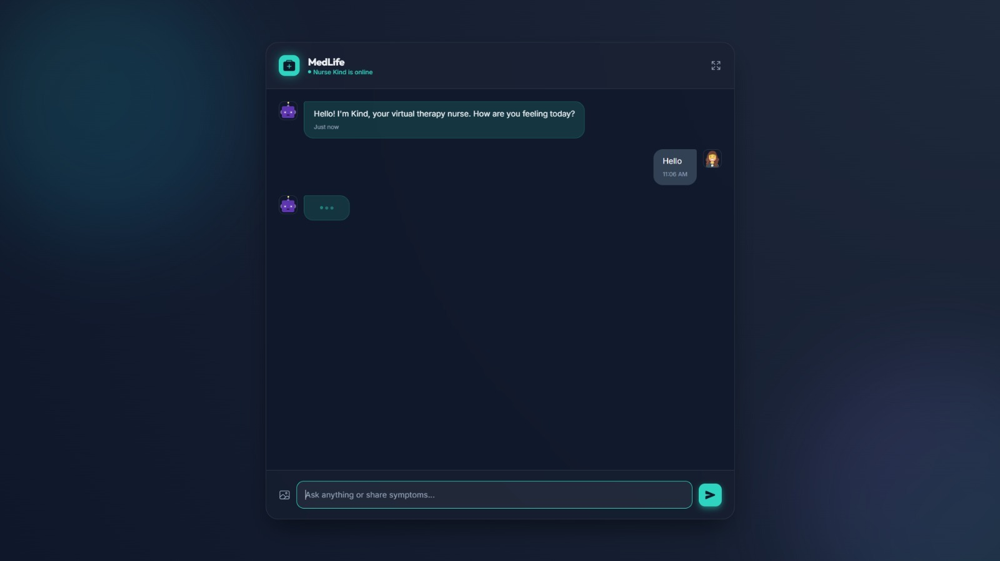
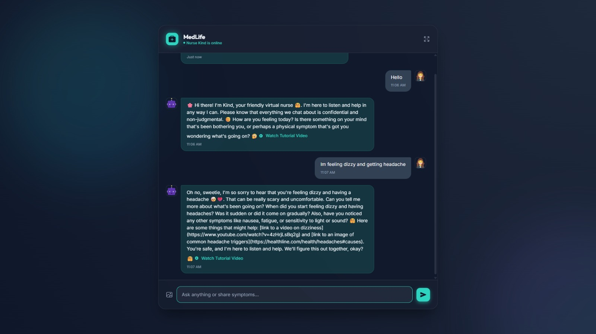

# Project Screenshots
## Homepage

## Chatbot Demo

# MedLife: AI-Based Personalized Health Support System


## Overview
MedLife is an AI-powered personalized health support system designed to provide conversational emotional support and basic health guidance using NLP and Flask.

The project integrates:
- AI conversational support
- Image-based wound guidance
- Health-related image and video suggestions
- Interactive web interface

## Features
- Conversational AI chatbot
- Flask backend integration
- HTML frontend UI
- Image upload support
- Health media recommendations
- NLP-based response handling

## Technologies Used
- Python
- Flask
- HTML/CSS
- NLP
- DuckDuckGo Search API
- Ollama
- Google Colab

## Project Structure
```text
MedLife/
│
├── server1.py
├── UI.html
├── FILES/

## Installation

Clone the repository
```bash
git clone https://github.com/YOUR-USERNAME/MedLife-AI-Based-Personalized-Health-Support-System.git
cd MedLife-AI-Based-Personalized-Health-Support-System
pip install flask flask-cors ollama duckduckgo-search pillow pyngrok
```
```

## How to Run

### Start the Flask server

```bash
python server1.py
```

### Open the generated ngrok or localhost URL in browser

### Interact with the AI health support chatbot

## Dependencies
- Flask
- Flask-CORS
- Ollama
- DuckDuckGo Search
- Pillow
- Pyngrok


- ## Future Improvements
- Advanced AI health recommendations
- Real-time doctor consultation integration
- Voice-based interaction
- Improved wound detection system
- Multi-language support
- Enhanced UI/UX design
